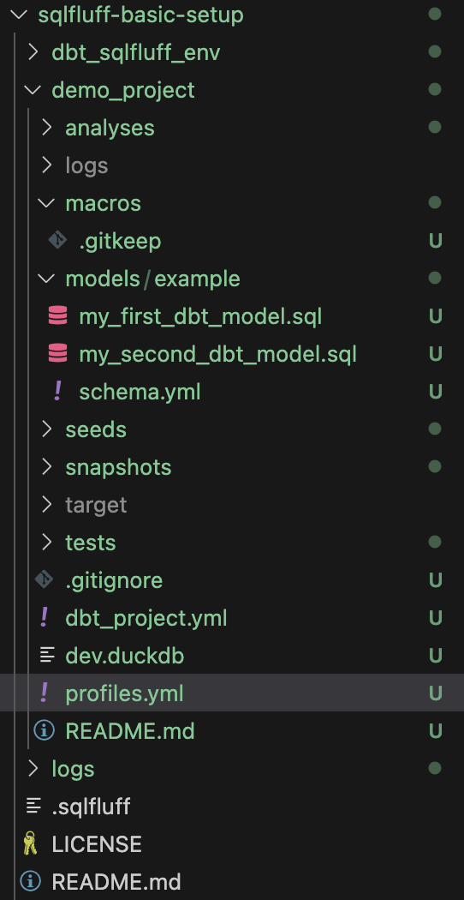

# SQLFluff basic setup

A hands-on tutorial on setting up SQLFluff in a dbt project.

### Requirements

- Python >= 3.11

## Usage

Create a new virtual environment

Keep things clean by isolating your dependencies:

```bash
python3 -m venv dbt_sqlfluff_env
source dbt_sqlfluff_env/bin/activate  # Linux/macOS
# of op Windows:
# dbt_sqlfluff_env\Scripts\activate
```

Install duckdb (easy to setup in memory database)

```bash
pip install --upgrade pip
pip install duckdb
```

Install dbt + duckdb adapter + sqlfluff + sqlfluff dbt templater

```bash
pip install "dbt-core<1.10" dbt-duckdb==1.9.2 sqlfluff==3.5 sqlfluff-templater-dbt==3.5

```

copy over .sqlfluff in root of your project.

Initialize a new dbt project and select option 1 when asking for 'Which database would you like to use?' (duckdb)

```bash
dbt init demo_project
cd demo_project
```

copy over the profiles.yml file into the demo_project folder!
This is needed to make sqfluff work. and is best practice in dbt as well!

your folder should now look like this


Run the dbt project to see installation and configuration was done correctly

```bash
dbt run
```

Run the sqlfluff lint command

```bash
sqlfluff lint models/
```

Run the sqlfluff fix command to see the fix in action!

```bash
sqlfluff fix models/
```
